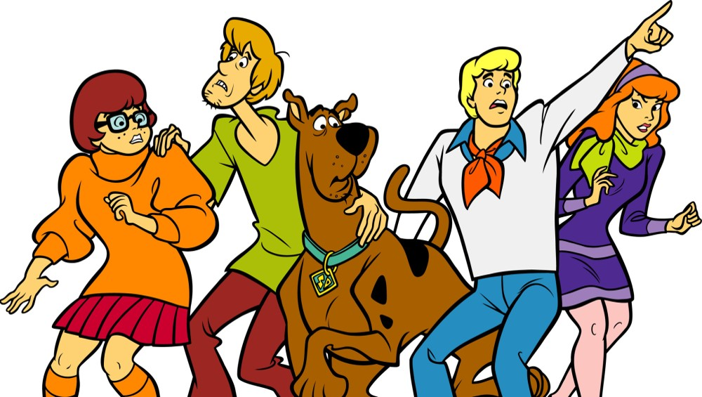
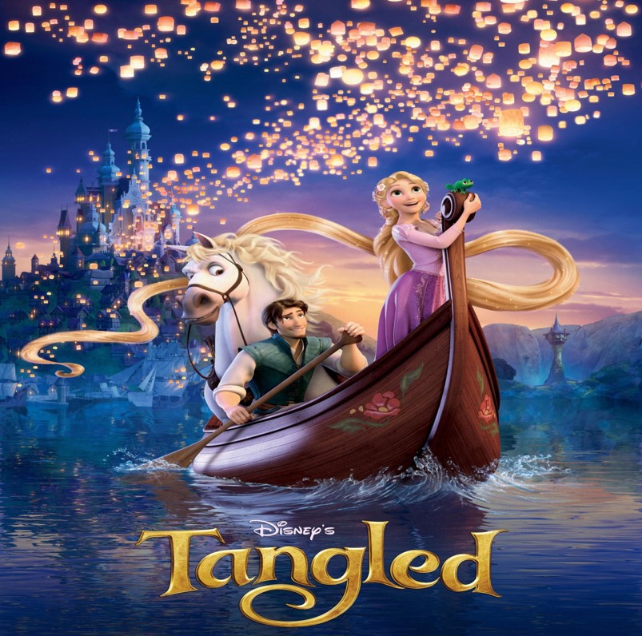
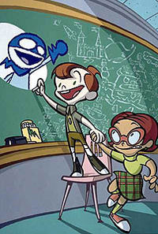
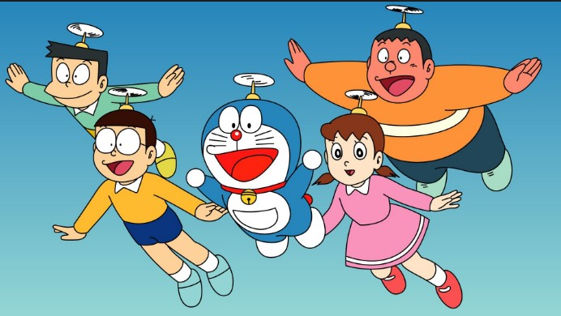
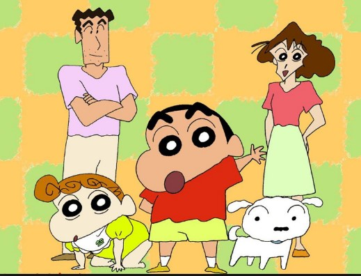

<!DOCTYPE html>
<html>
<title>MY TEMPLATE</title>
<meta charset="UTF-8">
<meta name="viewport" content="width=device-width, initial-scale=1">
<link rel="stylesheet" href="https://www.w3schools.com/w3css/4/w3.css">
<link rel="stylesheet" href="https://fonts.googleapis.com/css?family=Raleway">
<link rel="stylesheet" href="https://cdnjs.cloudflare.com/ajax/libs/font-awesome/4.7.0/css/font-awesome.min.css">

<body class="w3-light-blue w3-content" style="max-width:1600px">

<!-- Sidebar/menu -->
<nav class="w3-sidebar w3-collapse w3-white w3-animate-left" style="z-index:3;width:300px;" id="mySidebar"> 
  

    <a href="#" onclick="w3_close()" class="w3-hide-large w3-right w3-jumbo w3-padding w3-hover-grey" title="close menu">
      <i class="fa fa-remove"></i>
    </a>
      
    <h4><b>TEMPLATE</b></h4>
    
Template by ADHITYAS

  

  

    <a href="#Template" onclick="w3_close()" class="w3-bar-item w3-button w3-padding w3-text-teal"><i class="fa fa-th-large fa-fw w3-margin-right"></i>TEMPLATE</a> 
    <a href="#about" onclick="w3_close()" class="w3-bar-item w3-button w3-padding"><i class="fa fa-user fa-fw w3-margin-right"></i>ABOUT</a> 
    <a href="#contact" onclick="w3_close()" class="w3-bar-item w3-button w3-padding"><i class="fa fa-envelope fa-fw w3-margin-right"></i>CONTACT</a>
  

  

    <i class="fa fa-facebook-official w3-hover-opacity"></i>
    <i class="fa fa-instagram w3-hover-opacity"></i>
    <i class="fa fa-snapchat w3-hover-opacity"></i>
    <i class="fa fa-pinterest-p w3-hover-opacity"></i>
    <i class="fa fa-twitter w3-hover-opacity"></i>
    <i class="fa fa-linkedin w3-hover-opacity"></i>
  

</nav>

<!-- Overlay effect when opening sidebar on small screens -->

<!-- !PAGE CONTENT! -->

  <!-- Header -->
  <header id="template">
    
    <i class="fa fa-bars"></i>
    

    <h1><b>Contoh Animasi 2D dan 3D</b></h1>
    

      Filter: 
      <button class="w3-button w3-black">ALL</button>
      <button class="w3-button w3-white"><i class="fa fa-diamond w3-margin-right"></i>Design</button>
      <button class="w3-button w3-white w3-hide-small"><i class="fa fa-photo w3-margin-right"></i>Photos</button>
      <button class="w3-button w3-white w3-hide-small"><i class="fa fa-map-pin w3-margin-right"></i>Art</button>
    

    

  </header>
  
  <!-- First Photo Grid-->
  

    

      
      

        
<b>Tom And Jerry</b>

        
Tom and Jerry adalah serial film animasi Amerika yang dibuat pada tahun 1940 oleh William Hanna dan Joseph Barbera. Ini berpusat pada persaingan antara dua karakter judulnya, Tom, kucing, dan Jerry, tikus, dan banyak karakter berulang, yang didasarkan pada komedi slapstick.

      

    

    

      
      

        
<b>Scooby-Doo</b>

        
Serial animasi Scooby-Doo diciptakan oleh Joe Ruby, Ken Spears (cerita) dan Iwao Takamoto (perancang karakter) untuk Hanna-Barbera Productions --- produser film animasi yang menghasilkan banyak seri-seri lainnya yang berhubungan dengan Scooby-Doo -- hingga dibelinya rumah produksi ini oleh Warner Bros. pada tahun 1997. Warner Bros. ini kemudian meneruskan produksi serial animasi ini sejak saat itu.

.

      

    

    

      
      

        
<b>Toy Story</b>

        
Toy Story adalah film komedi petualangan animasi komputer Amerika tahun 1995 yang diproduksi oleh Pixar Animation Studios untuk Walt Disney Pictures. Berlangsung di dunia di mana mainan antropomorfik berpura-pura mati ketika manusia hadir, plotnya berfokus pada hubungan antara Woody, boneka koboi kuno, dan Buzz Lightyear.

      

    

  

  
  <!-- Second Photo Grid-->
  

    

      
      

        
<b>Tangled</b>

        
Kisah seorang gadis muda lugu, Rapunzel, dikurung ibunya yang sangat protektif padanya. Dia ingin melarikan diri ke dunia luar, akhirnya menjadi kenyataan dengan bantuan pencuri yang baik hati, Flynn..

      

    

    

      
      

        
<b>Keluarga Pak Somat</b>

        
Film animasi keluarga somat banyak digemari di kalangan masyarakat karena film ini bergenre komedi dan diproduksi oleh Dreamtoon Baros Studio, PT Animasi Kartun Indonesia. Film animasi ini asli buatan Indonesia dengan durasi 11 menit dan menggunakan bahasa Indonesia. Film animasi ini mulai ditayangkan di televisi pada tahun 2013-2015 sudah menayangkan 232 episode.
.

      

    

    

      
      

        
<b>Chalk Zone</b>

        
Serial ini berkisar pada petualangan Rudy bersama Snap kawannya dan teman sekelasnya Penny Sanchez. Rudy Tabootie merupakan seorang anak kecil berusia 10 tahun yang gemar menggambar, Penny Sanchez merupakan teman perempuan yang sekelas dengan Rudy dan dia sangat pintar. Selanjutnya ada Snap, snap merupakan makhluk biru yang baik yang berasal dari dunia kapur. Snap adalah hasil gambar ciptaan Rudy pada usia 8 tahun.

      

    

  

  <!-- Pagination -->
  

    

      <a href="#" class="w3-bar-item w3-button w3-hover-black">«</a>
      <a href="#" class="w3-bar-item w3-black w3-button">1</a>
      <a href="#" class="w3-bar-item w3-button w3-hover-black">2</a>
      <a href="#" class="w3-bar-item w3-button w3-hover-black">3</a>
      <a href="#" class="w3-bar-item w3-button w3-hover-black">4</a>
      <a href="#" class="w3-bar-item w3-button w3-hover-black">»</a>
    

  

  <!-- Images of Me -->
 

     
     

    <h4><b>About Me</b></h4>
    
Hallo teman-teman! Perkenalkan nama saya Adhityas Nugraheni Basqoro biasa dipanggil Tyas. Saya membuat template seperti ini agar kalian dapat menambah ilmu tentang contoh animasi 2D dan 3D. Semoga bermanfaat untuk kalian yang membaca.

    

  <!-- Contact Section -->
  

    <h4 id="contact"><b>Contact Me</b></h4>
    

      

        
<i class="fa fa-envelope w3-xxlarge w3-text-light-grey"></i>

        
tyasheni9@gmail.com

      

      

        
<i class="fa fa-map-marker w3-xxlarge w3-text-light-grey"></i>

        
Surakarta, ID

      

      

        
<i class="fa fa-phone w3-xxlarge w3-text-light-grey"></i>

        
6271567116

      

    

    

    <form action="/action_page.php" target="_blank">
      

        <label>Name</label>
        <input class="w3-input w3-border" type="text" name="Name" required>
      

      

        <label>Email</label>
        <input class="w3-input w3-border" type="text" name="Email" required>
      

      

        <label>Message</label>
        <input class="w3-input w3-border" type="text" name="Message" required>
      

      <button type="submit" class="w3-button w3-black w3-margin-bottom"><i class="fa fa-paper-plane w3-margin-right"></i>Send Message</button>
    </form>
  

  <!-- Footer -->
  <footer class="w3-container w3-padding-32 w3-dark-grey">
  

    

      <h3>FOOTER</h3>
      
Template ini berisi tentang contoh-contoh animasi 2D dan 3D.

      
Dibuat oleh Adhityas

    

  
    

      <h3>BLOG POSTS</h3>
      <ul class="w3-ul w3-hoverable">
        <li class="w3-padding-16">
          
          Doraemon 
          Kartun terpopuler
        </li>
        <li class="w3-padding-16">
          
          Sinchan 
          Kartun terpopuler
        </li> 
      </ul>
    

    

      <h3>POPULAR TAGS</h3>
      

        Travel Japan London
        Indonesian Cartoon DIY
        Animation Child Family
        News Clothing Shopping
        Food Games
      

    

  

  </footer>
  
  
Powered by <a href="https://www.w3schools.com/w3css/default.asp" title="W3.CSS" target="_blank" class="w3-hover-opacity">w3.css</a>

<!-- End page content -->

</body>
</html>
